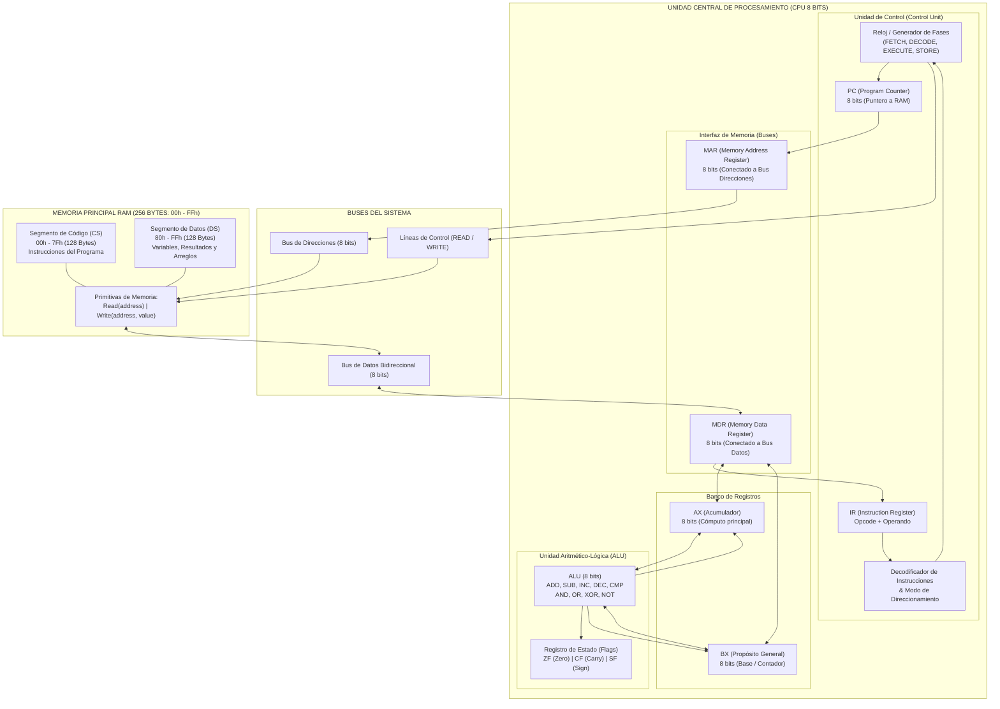

# Simulador de CPU von Neumann (8 bits) y Memoria Principal

**Universidad Católica Boliviana «San Pablo»**  
**Departamento de Ingenierías y Ciencias Exactas — Carrera de Ingeniería de Software**  
**Materia:** Arquitectura de Computadoras (SIS-131) — Semestre 1/2026  
**Docente:** Ing. Paulo César Loayza Carrasco  
**Estudiante:** **Javier Torrico Sejas**  
**Repositorio GitHub:** [https://github.com/Javiertorricos/Simulador_CPU_Excel](https://github.com/Javiertorricos/Simulador_CPU_Excel)  
**Tablero Kanban (GitHub Projects):** [https://github.com/users/Javiertorricos/projects/1](https://github.com/users/Javiertorricos/projects/1)  

---

## 1. Resumen Ejecutivo y Propósito del Proyecto

El presente proyecto implementa un **simulador visual, interactivo y didáctico** del ciclo completo de instrucción y de la gestión de memoria principal de un procesador de 8 bits con arquitectura von Neumann y conjunto de instrucciones tipo x86 simplificado, desarrollado en **Microsoft Excel con macros programadas en Visual Basic for Applications (VBA)** (`Simulador_CPU_8bits_Javier_Torrico.xlsm`).

El sistema modela fielmente el núcleo de procesamiento:
- **Unidad de Control (UC):** Contador de Programa (`PC`), Registro de Instrucción (`IR`), Decodificador de Instrucciones y Secuenciador de Fases del Reloj.
- **Unidad Aritmético-Lógica (ALU):** Operaciones aritméticas y lógicas de 8 bits con cálculo riguroso de banderas de estado (`ZF`, `CF`, `SF`).
- **Banco de Registros:** Acumulador (`AX`), Registro General (`BX`), Registro de Direcciones de Memoria (`MAR`) y Registro de Datos de Memoria (`MDR`).
- **Memoria Principal (RAM):** 256 posiciones de 8 bits (`00h` a `FFh`) organizadas en una matriz 16×16, con segmentación lógica visible entre el **Segmento de Código** (`00h` - `7Fh`) y el **Segmento de Datos** (`80h` - `FFh`).
- **Operaciones Primitivas:** Subrutinas dedicadas `Read(address)` y `Write(address, value)` con panel de auditoría en tiempo real.
- **Ciclo de Instrucción Completo de 4 Fases:** Descomposición explícita en **Fetch (Búsqueda)**, **Decode (Decodificación)**, **Execute (Ejecución)** y **Store (Almacenamiento/Write-back)**.
- **Ensamblador Integrado:** Ensamblador de dos pasadas en la misma hoja con resolución de etiquetas y carga inmediata en RAM.

---

## 2. Diagrama de Arquitectura de Bloques (Mermaid)

El siguiente diagrama formal en Mermaid ilustra la interconexión entre la Unidad de Control, la ALU, los Registros, los Buses del Sistema y la Memoria Principal:



---

## 3. Repertorio de Instrucciones (ISA)

La CPU implementa un conjunto sistemático de instrucciones tipo x86 de 8 bits. Cada instrucción ocupa 1 o 2 bytes:
- **1 Byte:** Instrucciones de control o que operan exclusivamente entre registros (`Opcode`).
- **2 Bytes:** Instrucciones con operando inmediato, dirección de memoria o destino de bifurcación (`Opcode` + `Operando`).

| Opcode (Hex) | Mnemónico | Operandos | Bytes | Flags Afectados | Descripción Semántica (RTL) |
|:---:|:---|:---:|:---:|:---:|:---|
| `00h` | **HLT** | Ninguno | 1 | - | Detiene el reloj del CPU (`Halted = True`). |
| `01h` | **NOP** | Ninguno | 1 | - | No operación. Avanza al siguiente ciclo. |
| `10h` | **MOV** | `AX, imm` | 2 | - | `AX <- imm` (Carga valor inmediato en AX). |
| `11h` | **MOV** | `BX, imm` | 2 | - | `BX <- imm` (Carga valor inmediato en BX). |
| `12h` | **MOV** | `AX, BX` | 1 | - | `AX <- BX` (Copia el contenido de BX en AX). |
| `13h` | **MOV** | `BX, AX` | 1 | - | `BX <- AX` (Copia el contenido de AX en BX). |
| `20h` | **LOAD** / **MOV** | `AX, [dir]` | 2 | - | `MAR <- dir; MDR <- Read(MAR); AX <- MDR` |
| `21h` | **LOAD** / **MOV** | `BX, [dir]` | 2 | - | `MAR <- dir; MDR <- Read(MAR); BX <- MDR` |
| `22h` | **STORE** / **MOV** | `[dir], AX` | 2 | - | `MAR <- dir; MDR <- AX; Write(MAR, MDR)` |
| `23h` | **STORE** / **MOV** | `[dir], BX` | 2 | - | `MAR <- dir; MDR <- BX; Write(MAR, MDR)` |
| `30h` | **ADD** | `AX, imm` | 2 | ZF, CF, SF | `AX <- AX + imm`; actualiza banderas. |
| `31h` | **ADD** | `BX, imm` | 2 | ZF, CF, SF | `BX <- BX + imm`; actualiza banderas. |
| `32h` | **ADD** | `AX, BX` | 1 | ZF, CF, SF | `AX <- AX + BX`; actualiza banderas. |
| `33h` | **ADD** | `BX, AX` | 1 | ZF, CF, SF | `BX <- BX + AX`; actualiza banderas. |
| `40h` | **SUB** | `AX, imm` | 2 | ZF, CF, SF | `AX <- AX - imm`; actualiza banderas. |
| `41h` | **SUB** | `BX, imm` | 2 | ZF, CF, SF | `BX <- BX - imm`; actualiza banderas. |
| `42h` | **SUB** | `AX, BX` | 1 | ZF, CF, SF | `AX <- AX - BX`; actualiza banderas. |
| `43h` | **SUB** | `BX, AX` | 1 | ZF, CF, SF | `BX <- BX - AX`; actualiza banderas. |
| `50h` | **CMP** | `AX, imm` | 2 | ZF, CF, SF | Compara `AX - imm`. Actualiza flags; AX no cambia. |
| `51h` | **CMP** | `BX, imm` | 2 | ZF, CF, SF | Compara `BX - imm`. Actualiza flags; BX no cambia. |
| `52h` | **CMP** | `AX, BX` | 1 | ZF, CF, SF | Compara `AX - BX`. Actualiza flags; AX no cambia. |
| `53h` | **CMP** | `BX, AX` | 1 | ZF, CF, SF | Compara `BX - AX`. Actualiza flags; BX no cambia. |
| `60h` | **INC** | `AX` | 1 | ZF, SF | `AX <- AX + 1` (CF se preserva en x86). |
| `61h` | **INC** | `BX` | 1 | ZF, SF | `BX <- BX + 1` (CF se preserva en x86). |
| `62h` | **DEC** | `AX` | 1 | ZF, SF | `AX <- AX - 1` (CF se preserva en x86). |
| `63h` | **DEC** | `BX` | 1 | ZF, SF | `BX <- BX - 1` (CF se preserva en x86). |
| `64h` | **NOT** | `AX` | 1 | - | `AX <- NOT AX` (Inversión bit a bit de AX). |
| `65h` | **NOT** | `BX` | 1 | - | `BX <- NOT BX` (Inversión bit a bit de BX). |
| `70h` | **AND** | `AX, imm` | 2 | ZF, SF, CF=0 | `AX <- AX AND imm`; CF se limpia a 0. |
| `71h` | **AND** | `BX, imm` | 2 | ZF, SF, CF=0 | `BX <- BX AND imm`; CF se limpia a 0. |
| `72h` | **AND** | `AX, BX` | 1 | ZF, SF, CF=0 | `AX <- AX AND BX`; CF se limpia a 0. |
| `73h` | **AND** | `BX, AX` | 1 | ZF, SF, CF=0 | `BX <- BX AND AX`; CF se limpia a 0. |
| `80h` | **OR** | `AX, imm` | 2 | ZF, SF, CF=0 | `AX <- AX OR imm`; CF se limpia a 0. |
| `81h` | **OR** | `BX, imm` | 2 | ZF, SF, CF=0 | `BX <- BX OR imm`; CF se limpia a 0. |
| `82h` | **OR** | `AX, BX` | 1 | ZF, SF, CF=0 | `AX <- AX OR BX`; CF se limpia a 0. |
| `83h` | **OR** | `BX, AX` | 1 | ZF, SF, CF=0 | `BX <- BX OR AX`; CF se limpia a 0. |
| `90h` | **XOR** | `AX, imm` | 2 | ZF, SF, CF=0 | `AX <- AX XOR imm`; CF se limpia a 0. |
| `91h` | **XOR** | `BX, imm` | 2 | ZF, SF, CF=0 | `BX <- BX XOR imm`; CF se limpia a 0. |
| `92h` | **XOR** | `AX, BX` | 1 | ZF, SF, CF=0 | `AX <- AX XOR BX`; CF se limpia a 0. |
| `93h` | **XOR** | `BX, AX` | 1 | ZF, SF, CF=0 | `BX <- BX XOR AX`; CF se limpia a 0. |
| `A0h` | **JMP** | `dir` | 2 | - | Salto incondicional: `PC <- dir`. |
| `A1h` | **JZ** | `dir` | 2 | - | Salto si Zero=1: si `ZF == 1` entonces `PC <- dir`. |
| `A2h` | **JNZ** | `dir` | 2 | - | Salto si Zero=0: si `ZF == 0` entonces `PC <- dir`. |

---

## 4. Descomposición del Ciclo de Instrucción (4 Fases del Reloj)

Cada instrucción pasa rigurosamente por cuatro fases secuenciales:

### Fase 1: FETCH (Búsqueda de la Instrucción)
1. La dirección almacenada en el Contador de Programa (`PC`) se transfiere al Registro de Direcciones de Memoria: `MAR <- PC`.
2. Se activa la línea de control de lectura y la subrutina primitiva lee el byte de memoria: `MDR <- Read(MAR)`.
3. El byte recién leído pasa al Registro de Instrucción: `IR_Opcode <- MDR`.
4. El Contador de Programa se incrementa: `PC <- (PC + 1) AND FFh`.

### Fase 2: DECODE (Decodificación)
1. La Unidad de Control interpreta el `IR_Opcode` para determinar la operación y el modo de direccionamiento.
2. Si la instrucción requiere un segundo byte (operando inmediato, dirección de memoria o destino de salto):
   - `MAR <- PC`
   - `MDR <- Read(MAR)`
   - `IR_Operando <- MDR`
   - `PC <- (PC + 1) AND FFh`
3. Si la instrucción es de 1 byte, `IR_Operando` se establece en `00h`.

### Fase 3: EXECUTE (Ejecución)
1. Para operaciones aritméticas y lógicas (`ADD`, `SUB`, `INC`, `DEC`, `AND`, `OR`, `XOR`, `NOT`, `CMP`):
   - La ALU procesa los operandos y genera el resultado temporal.
   - Se actualizan rigurosamente las banderas `ZF`, `CF` y `SF`.
2. Para transferencias de memoria:
   - En `LOAD`: `MAR <- IR_Operando; MDR <- Read(MAR)`.
   - En `STORE`: `MAR <- IR_Operando; MDR <- RegOrigen`.
3. Para bifurcaciones (`JMP`, `JZ`, `JNZ`):
   - Se evalúa la condición de salto. Si es verdadera, se activa la bandera interna `SaltoTomado = True`.
4. Para `HLT`: Se activa la bandera `Halted = True`.

### Fase 4: STORE / WRITE-BACK (Almacenamiento)
1. En operaciones ALU (excepto `CMP`): El resultado se guarda en el registro destino (`AX` o `BX`).
2. En `LOAD`: El dato en `MDR` se transfiere al registro destino (`AX` o `BX`).
3. En `STORE`: Se ejecuta la primitiva de escritura física en RAM: `Write(MAR, MDR)`.
4. En saltos: Si `SaltoTomado == True`, se actualiza el puntero: `PC <- IR_Operando`.
5. Se incrementa el contador de instrucciones completadas y el ciclo vuelve a la Fase 1 (Fetch).

---

## 5. Manual de Usuario Paso a Paso

### 5.1. Apertura y Habilitación de Macros
1. Abre el libro **`Simulador_CPU_8bits_Javier_Torrico.xlsm`** en Microsoft Excel.
2. Si aparece la barra amarilla de seguridad en la parte superior, pulsa **«Habilitar contenido»** (o *Enable Macros*).
3. *(Nota de seguridad Windows)*: Si el archivo fue descargado de GitHub y muestra la barra roja de bloqueo, haz clic derecho en el archivo en el Explorador de Windows → **Propiedades** → marca la casilla **Desbloquear** (*Unblock*) → **Aceptar**, y vuelve a abrirlo.

### 5.2. Carga y Edición de Programas
- **Carga Rápida con 1 Clic:** En la parte inferior izquierda se encuentran cuatro botones de acceso rápido:
  - `1. Multiplicación (6*7)`
  - `2. Serie Fibonacci`
  - `3. Factorial (4!)`
  - `4. Cuenta Regresiva`
  Al presionar cualquiera de ellos, el código mnemónico se escribe en la tabla del editor, se ensambla automáticamente, se generan los bytes máquina y se cargan en la RAM.
- **Escribir Código Propio:** Puedes editar o escribir directamente tus instrucciones en la columna **C** (filas 7 a 26). Luego pulsa **«CARGAR PROGRAMA»** para ensamblarlo y cargarlo en la memoria.

### 5.3. Botones de Control de la CPU
| Botón | Macro Vinculada | Acción Ejecutada |
|---|---|---|
| **CARGAR PROGRAMA** | `Btn_CargarPrograma` | Ensambla el código del editor, limpia la RAM y la carga desde `00h`. |
| **PASO A PASO** | `Btn_PasoFase` | Avanza **una fase del reloj** (`Fetch` -> `Decode` -> `Execute` -> `Store`). |
| **INSTRUCCION >>** | `Btn_PasoInstruccion` | Ejecuta las fases necesarias hasta completar la instrucción actual. |
| **CONTINUO (RUN ▶)** | `Btn_Run` | Ejecuta de forma automática y secuencial con animación hasta llegar a `HLT`. |
| **PAUSAR ⏸** | `Btn_Pausa` | Detiene temporalmente el modo continuo al concluir la fase activa. |
| **REINICIAR ↺** | `Btn_Reset` | Restablece todos los registros (`PC=0`, `AX=0`, `BX=0`, flags=0) y limpia la RAM. |

### 5.4. Control de Velocidad del Reloj
- En la celda **E30** puedes cambiar el valor de velocidad del reloj entre **1** y **5**:
  - `1`: Modo muy lento (0.8 segundos por fase, ideal para observar cada transferencia).
  - `3`: Modo estándar (0.3 segundos por fase).
  - `5`: Modo rápido (0.05 segundos por fase).

### 5.5. Inspección y Edición de Memoria en Vivo
- **Inspector de Memoria (Filas 23-25):** Muestra de forma inmediata el valor de la celda de memoria activa en formato **Hexadecimal**, **Binario de 8 bits**, **Decimal con/sin signo**, **Segmento al que pertenece** y su **Interpretación como Instrucción x86**.
- **Modificación en Vivo:** Durante la defensa oral o en cualquier momento, puedes escribir directamente un valor hexadecimal (ej. `32` para `ADD AX, BX` o `00` para `HLT`) en cualquier celda de la matriz 16×16 (`R6:AG21`).

---

## 6. Programas Demostrativos y Traza de Ejecución

### Programa 1 (Obligatorio): Multiplicación por Sumas Sucesivas (`6 × 7 = 42`)
Este programa multiplica `6 × 7` mediante un bucle de 7 iteraciones sumando `6` al acumulador `AX` y decrementando el contador `BX`. Al finalizar, guarda el resultado `42` (`2Ah`) en la celda `80h` del Segmento de Datos y se detiene con `HLT`.

```asm
; =====================================================================
; Programa 1: Multiplicación por sumas sucesivas (6 * 7 = 42 = 2Ah)
; =====================================================================
0x00: MOV AX, 0       ; Bytes: 10 00 | AX = 0 (acumulador del producto)
0x02: MOV BX, 7       ; Bytes: 11 07 | BX = 7 (contador multiplicador)
0x04: BUCLE:
0x04: ADD AX, 6       ; Bytes: 30 06 | AX = AX + 6
0x06: DEC BX          ; Bytes: 63    | BX = BX - 1 (actualiza ZF)
0x07: JNZ BUCLE       ; Bytes: A2 04 | Si BX != 0 (ZF=0), salta a 0x04
0x09: STORE [80h], AX ; Bytes: 22 80 | Guarda 42 (2Ah) en RAM[80h] (Datos)
0x0B: HLT             ; Bytes: 00    | Fin del programa
```

#### Traza Matemática y de Registros Paso a Paso:
| Ciclo / Fase | Fase Reloj | PC | MAR | MDR | IR (Opcode) | AX | BX | ZF | CF | SF | RAM[80h] | Descripción de la Micro-operación |
|:---:|:---:|:---:|:---:|:---:|:---:|:---:|:---:|:---:|:---:|:---:|:---:|:---|
| **01** | FETCH | `01h` | `00h` | `10h` | `10h` | `00h` | `00h` | 0 | 0 | 0 | `00h` | `MAR<-00h, MDR<-Read(00h)=10h, IR<-10h, PC++` |
| **02** | DECODE | `02h` | `01h` | `00h` | `10h` | `00h` | `00h` | 0 | 0 | 0 | `00h` | `Lee operando inmediato 00h; PC++ a 02h` |
| **03** | EXECUTE| `02h` | `01h` | `00h` | `10h` | `00h` | `00h` | 0 | 0 | 0 | `00h` | `Prepara transferencia de 00h hacia AX` |
| **04** | STORE | `02h` | `01h` | `00h` | `10h` | `00h` | `00h` | 0 | 0 | 0 | `00h` | `AX <- 00h. Instrucción MOV completada.` |
| **05** | FETCH | `03h` | `02h` | `11h` | `11h` | `00h` | `00h` | 0 | 0 | 0 | `00h` | `Lee opcode 11h (MOV BX, imm); PC++ a 03h` |
| **06** | DECODE | `04h` | `03h` | `07h` | `11h` | `00h` | `00h` | 0 | 0 | 0 | `00h` | `Lee operando inmediato 07h; PC++ a 04h` |
| **07** | EXECUTE| `04h` | `03h` | `07h` | `11h` | `00h` | `00h` | 0 | 0 | 0 | `00h` | `Prepara carga de 07h hacia BX` |
| **08** | STORE | `04h` | `03h` | `07h` | `11h` | `00h` | `07h` | 0 | 0 | 0 | `00h` | `BX <- 07h. Instrucción MOV completada.` |
| **...**| ... | ... | ... | ... | ... | ... | ... | ... | ... | ... | ... | *(Iteraciones 1 a 6: suma 6 a AX, decrementa BX, JNZ salta)* |
| **Iter 7**| EXECUTE| `07h` | `06h` | `63h` | `63h` | `2Ah` | `00h` | **1**| 0 | 0 | `00h` | `DEC BX: BX = 0 -> ZF se activa en 1` |
| **Iter 7**| EXECUTE| `09h` | `07h` | `A2h` | `A2h` | `2Ah` | `00h` | **1**| 0 | 0 | `00h` | `JNZ evalúa ZF=1: Condición no se cumple, NO salta` |
| **Store**| STORE | `0Bh` | `80h` | `2Ah` | `22h` | `2Ah` | `00h` | 1 | 0 | 0 | **`2Ah`**| `Write(80h, 2Ah): Guarda 42 en RAM[80h]` |
| **Halt** | EXECUTE| `0Ch` | `0Bh` | `00h` | `00h` | `2Ah` | `00h` | 1 | 0 | 0 | `2Ah` | `HLT alcanzado: Reloj detenido exitosamente.` |

---

## 7. Estructura Modular del Código Fuente (VBA)

El código fuente ha sido diseñado bajo una estricta separación de responsabilidades y modularidad limpia:

```
Proyecto_CPU/
├── Simulador_CPU_8bits_Javier_Torrico.xlsm   # Libro de cálculo con macros habilitadas (.xlsm)
├── README.md                                 # Documentación técnica completa
├── GITHUB_ISSUES_KANBAN_EN.md                # 14 Issues para GitHub Projects en inglés
├── GUIA_DEFENSA_ORAL.md                      # Libreto de 15 minutos para la defensa oral
├── src/                                      # Código fuente modular en VBA (.bas)
│   ├── ModMemoria.bas                        # RAM 256 bytes, primitivas Read/Write, segmentación
│   ├── ModCPU.bas                            # Registros PC, IR, MAR, MDR, AX, BX, flags y reset
│   ├── ModALU.bas                            # Operaciones ALU y cálculo exacto de banderas
│   ├── ModCicloInstruccion.bas               # Motor de 4 fases (Fetch, Decode, Execute, Store)
│   ├── ModEnsamblador.bas                    # Ensamblador de 2 pasadas y 4 programas demo
│   └── ModInterfaz.bas                       # Formato visual, colores de fases, log y botones
└── scripts/
    └── Generar-Simulador-Javier.ps1          # Script PowerShell para generar el libro desde cero
```

---

## 8. Gestión de Proyecto y Metodología Kanban

El desarrollo del proyecto se administró en **GitHub Projects** utilizando un tablero Kanban de cinco columnas:
- **Backlog:** Especificaciones teóricas, análisis de la rúbrica y arquitectura base.
- **To Do:** Historias de usuario e issues priorizadas por fase.
- **In Progress:** Tareas en programación activa.
- **In Review / Testing:** Pruebas unitarias de la ALU, traza de ciclos y revisión de compatibilidad.
- **Done:** Tareas terminadas y validadas con sus criterios de aceptación cumplidos.

El desglose completo de las **14 tareas formales en inglés** con sus criterios de aceptación y archivos adjuntos se encuentra en el documento:  
👉 [GITHUB_ISSUES_KANBAN_EN.md](file:///c:/Users/Javier/OneDrive/Documentos/Arquitectura%20Computadora/Simulador_primer_Examen/von-neumann-simulador-cpu-8bits-excel-vba-main/von-neumann-simulador-cpu-8bits-excel-vba-main/Proyecto_CPU/GITHUB_ISSUES_KANBAN_EN.md).

---

## 9. Decisiones de Diseño e Ingeniería

1. **Incrementador Dedicado de PC:** El contador de programa `PC` cuenta con su propio mecanismo de incremento `PC = (PC + 1) AND FFh`, evitando sobreescribir el acumulador `AX` a través de la ALU para operaciones de control.
2. **Semántica de Banderas compatible con x86:**
   - `ZF`: Se activa si el resultado de 8 bits es cero (`00h`).
   - `CF`: Se activa ante desbordamiento sin signo en suma (`res > 255`) o préstamo en resta (`valA < valB`). Se limpia a 0 en operaciones lógicas (`AND`, `OR`, `XOR`). `INC` y `DEC` preservan `CF`.
   - `SF`: Refleja el bit más significativo (MSB, bit 7), activándose si el resultado es negativo en complemento a dos.
3. **Primitivas de Memoria Transparentes:** `Read(address)` y `Write(address, value)` operan tanto sobre el arreglo en memoria como sobre la cuadrícula matricial de Excel, asegurando sincronización al 100% y facilitando la explicación durante la defensa oral.
4. **Resaltado Dinámico de Bajo Impacto:** El motor de interfaz actualiza las celdas directamente sin depender de centenares de formas flotantes complejas, logrando una interfaz limpia, robusta y resistente a cambios de resolución.

---

## 10. Referencias Bibliográficas

- Tanenbaum, A. S., & Austin, T. (2013). *Structured Computer Organization* (6th ed.). Pearson.
- Stallings, W. (2016). *Computer Organization and Architecture: Designing for Performance* (10th ed.). Pearson.
- Intel Corporation. *Intel 8086 Family User's Manual: Architecture and Instruction Set*.
- Loayza Carrasco, P. C. (2026). *Material de la materia Arquitectura de Computadoras (SIS-131)*. Universidad Católica Boliviana "San Pablo".
